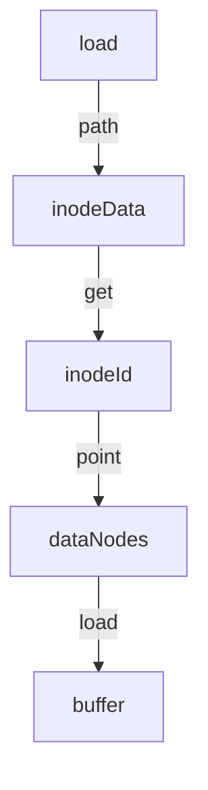

# disk

## flow



## storage
```
[super_block][inode_bitmap][data_bitmap][inode_blocks][data_blocks]
super_block: disk info
xxx_bitmap: if the block has data
inode_blocks: inode data,save metadata and some point to data_blocks
data_blocks: save data
(block:4K subblock:512b)
```


