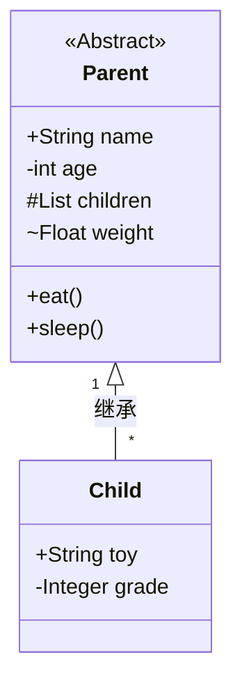

本文介绍如何使用Markdown绘制UML图

<!--more-->

1. 创建UML类图

   ````markdown
   ```mermaid
   classDiagram
   // 以上为固定写法,此处开始创建对象与关系
   ```
   ````

2. 类与接口

   - 创建

     ```
     class A {
     		
     }
     ```

     ```mermaid
     classDiagram
     class A {
     	
     }
     ```

   - 类型

     | 符号            | 类型      |
     | --------------- | --------- |
     | <<interface>>   | 接口      |
     | <<abstract>>    | 抽象类    |
     | <<service>>     | service类 |
     | <<enumeration>> | 枚举      |

     使用方式: 

     ```
     // 方式一：内嵌
     class A {
     <<Interface>>
     }
     
     // 方式二：单独的行
     class B
     <<Interface>> B
     ```

     ```mermaid
     classDiagram
     class A {
     	<<Interface>>
     }
     class B
     <<Interface>> B
     ```

     

   - 属性

     两种方式内联和单独指定

     方式一:

     ```
     class A
     A : +String name
     A : -int age
     A : List~Object~ child    //泛型变量
     A : +eat()
     A : +sleep(time)          //有参数的方法
     A : +getAge() int         //有返回值的方法
     ```

     ```mermaid
     classDiagram
     class A
     A : +String name
     A : -int age
     A : List~Object~ child    //泛型变量
     A : +eat()
     A : +sleep(time)          //有参数的方法
     A : +getAge() int         //有返回值的方法
     ```

     

     方式二:

     ```
     class B {
         +String name
         -int age
         List~Object~ child
         +eat()
         +sleep(time)
         +getAge() int
     }
     ```

     ```mermaid
     classDiagram
     class B {
         +String name
         -int age
         List~Object~ child
         +eat()
         +sleep(time)
         +getAge() int
     }
     ```

     

     元素可见范围:

     | 修饰符号 | 可见范围  |
     | :------- | --------- |
     | -        | private   |
     | +        | public    |
     | #        | protected |
     | ~        | package   |

3. 关系

   - 继承

     表示子类继承父类的所有特征和行为

     ```
     ClassA <|-- ClassB  // class B extends A
     ```

     ```mermaid
     classDiagram
     ClassA <|-- ClassB
     ```

     

   - 实现

     类是接口所有特征和行为的实现

     ```
     InterfaceA <|.. ClassB  // class B implements interface A
     ```

     ```mermaid
     classDiagram
     InterfaceA <|.. ClassB
     ```

     

   - 组合/聚合

     组合: 整体与部分的关系，但部分不能离开整体而单独存在 带实心菱形的实线，实心菱形指向整体

     聚合: 整体与部分的关系，且部分可以离开整体而单独存在 带空心菱形的实现，空心菱形指向整体。

     ```
     ClassA *-- ClassB  // class B is part of A
     ```

     ```mermaid
     classDiagram
     ClassA *-- ClassB
     ```

     

   - 关联

     一个类知道另一个类的属性和方法；关联可以是双向的，也可以是单向的。双向的关联可以有两个箭头或者没有箭头，单向的关联有一个箭头

     ```
     ClassA -- ClassB
     ClassC <-- ClassD
     ```

     ```mermaid
     classDiagram
     ClassA -- ClassB
     ClassC <-- ClassD
     ```

     

   - 依赖

     一个类的实现需要另一个类的协助

     ```
     ClassA <.. ClassB
     ```

     ```mermaid
     classDiagram
     ClassA <.. ClassB
     ```

     

   - 关系标识

     - 关系上添加标签

       ```
       ClassA <.. ClassB : 依赖
       ```

       ```mermaid
       classDiagram
       ClassA <.. ClassB : 依赖
       ```

       

     - 关系上添加数量

       | 符号 | 含义          |
       | ---- | ------------- |
       | 1    | 1个           |
       | 0..1 | 0或1个        |
       | 1..* | 1个或多个     |
       | *    | 任意个        |
       | n    | n个(n>1)      |
       | 0..n | 0个到n个(n>0) |
       | 1..n | 1到n个(n>1)   |

       

       ```
       ClassA "1" --> "*" ClassB
       ```

       ```mermaid
       classDiagram
       ClassA "1" --> "*" ClassB
       ```

       

4. 例子



